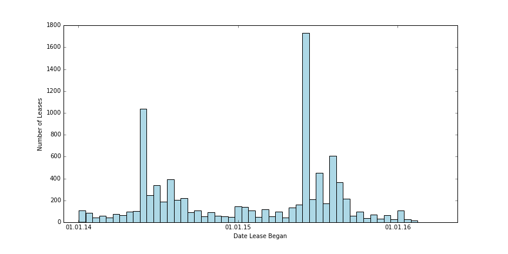
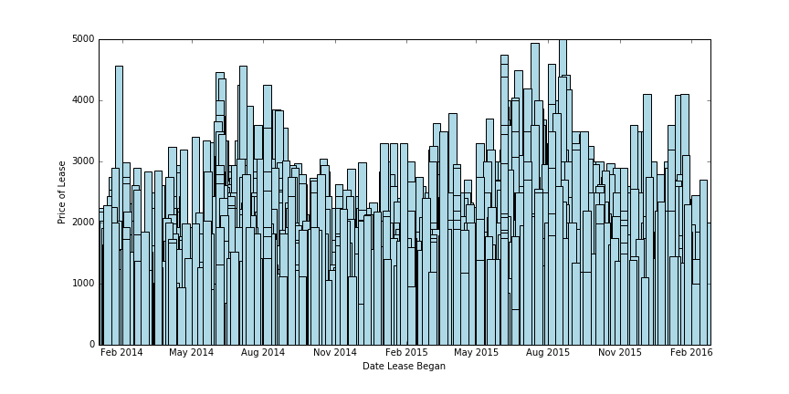

November's always the longest month of fall semester. The days get shorter, the afternoons get colder, rain starts falling, the leaves start falling (kidding, we don't have autumn in California), and for Berkeley seniors, it's the deadline for having your future figured out. Interviews, offers, negotiation - it's like no one can talk about anything else. And, as people start getting offers, they start thinking about moving into a new city. 

Being that this is Berkeley, a lot of people are moving to San Francisco after graduation, where rent prices are more expensive than organ donations (and apartments are probably harder to get than the aforementioned organs). An influx of (relatively) highly-paid tech workers along with a lack of new development has driven SF's cost of living to unsustainably high levels, and it makes moving to the city a difficult decision.

Rising rent in San Francisco then creates upward pressure on prices throughout the Bay, as people look outside the city to find more reasonable housing. Places like Oakland, South San Francisco, and Berkeley have all seen marked increases in rent prices that parallel San Francisco's. In particular, in Berkeley, this has had a compounding effect on already highly-demanded student-housing, increasing prices for students throughout the city. Berkeley already has a culture of off-campus housing. University housing is typically overpriced, and students move into their own apartments as early as possible. This leads to an incredibly competitive apartment search starting in March and persisting through August, which is only made worse by highly-paid engineers bidding up rents and forcing a lot of students out of traditionally student-dominated housing.

I started this project actually over the summer, when a number of my friends were looking for apartments. Back then, the idea was to create a craigslist scraper that notified you when an apartment fitting your criteria was posted. After some work though, I realized that studying rental trends themselves would be a much more interesting exercise, given that there's a wealth of data that's publicly available. And so, that's what this article is: I analyze rent data from two different sources, the Berkeley Rent Collection Board, and Craigslist, and use it first to both understand the current housing situation, and second apply some basic Machine Learning to understand what features drive apartment pricing. 

General Housing Trends 
----------------------
First, here's a general histogram of prices in Berkeley. This is based on data collected from Berkeley's Rent Collection Board, from which I was able to scrape rent information for 9143 currently occupied apartments in Berkeley, with leases starting from 2014. This is the price per room, averaged over the number of apartment buildings (I assumed that every building's rent per room was very similar due to rent-control).

{:class="img-responsive"}

As we can clearly see, this takes on a standard, normally-distributed shape, with an average of about 1400 and a standard deviation of around 200 dollars.

But, we want to explore the relationship of prices over time, and this isn't all that helpful in understanding that story. Instead, lets look at this histogram mapping every month to the number of leases initiated in that month: 

{:class="img-responsive"}

Ah, now this is more interesting. There's clearly a spike in leases around May of every year, paralleling Berkeley's academic calendar - school for the year ends in May, and people are finalizing their living arrangements for the next semester. This amount declines until January, when it starts rising again in the same pattern. Also, you'll notice that the total number of leases in 2015 is clearly more than in 2014, though the pattern of buying is the same. 

Then, combining the information from the two above graphs, we'd expect both a general uptick in prices over the past two years, and a rise in prices around May to August. Lets confirm that:

{:class="img-responsive"}

And that's exactly what we see! Rent prices for leases starting in May are clearly higher than in November through January. And, rent prices peak in July/August of each year, which makes sense: students buying that late are desperate for apartments and are willing to pay a premium for the limited remaining supply. We can also see a general rising trend in prices from 2014 to 2016, if you compare the same month across multiple years. 

Now, this gives us a general idea of rising rents across the entire city of Berkeley, with a majority of our data coming from mainly student-occupied housing. But, it doesn't account for local variation within the city itself. To tell that story, I made this map, which gives you information on rents in Berkeley in different sectors of the city, along with a bunch of other information: distance from campus (that is, to a point that's almost equidistant from each edge of campus), average room size (in square feet), and the average number of bedrooms. The extra information is taken by matching rent board data to Craigslist listings. There was about a 20% overlap for most sectors, so that data isn't that representative of the region, but it serves as a useful reference point. 

<!--<iframe src="https://www.google.com/maps/d/u/0/embed?mid=1JVcUdic5mWU80o5ntcWqmzSlWTM" width="640" height="480"></iframe>-->

As you can see, there are significant differences in pricing across neighborhoods. West Side seems to be, on average, the cheapest, but it also has the smallest room size. It also has lowest average number of bedrooms, indicating a higher percentage of 1 bedroom and studio apartments than elsewhere. 

Far North seems to have the largest apartments, but it has the farthest average distance to campus (it's also a long uphill walk, ugh). South Side has also a very high average price, and it's the closest to campus, and it's probably the most popular region for most. North Side seems to be the most expensive, but this may be skewed by a much lower density of student housing in that area (mostly engineers live on North Side). 

Finding an Intrinsic Price
--------------------------

- Discuss idea that an intrinsic price is the price when all factors are weighed similarly 
- Come to conclusion that the best way to determine some sort of intrinsic price for an apartment is to somehow combine data of all other apartments and see what price the features of this apartment would create
- This is the same problem as predicting a price, given some training data and listings!
 - Use machine learning, discuss why regression
- Show a sample comparison of a real listing 

Now that we have a better understanding of rent pricing in Berkeley, lets change course, and ask a more fundamental question: what is the intrinsic value of an apartment?

Economics says that all available information about an apartment is encompassed in its current price, and so, it has no intrinsic value: it's value is the price people are willing to pay (this is actually also the central assumption of technical stock analysis). This defintion, however, isn't particularly useful for us now, and so, I propose a different one.

The intrinsic value of an apartment with some arbitrary features is what another apartment, with exactly the same features, would sell for, averaged over all other apartments (where a feature represents some measurable quantity of the apartment that we can measure. Here, a feature could be square footage, or number of bathrooms, or etc.) 

But, this is the exactly the same problem as predicting prices! If we had some training set and a machine learning model trained on this training set, then, the price that model predicts for a given apartment is that apartment's intrinsic value (what that apartment would cost if we cared only about its features). Then, we can compare the actual price of that apartment and determine whether it's overvalued or undervalued relative to its intrinsic price. 

And that's what I did! I scraped about 5000 Craigslist listings over the past few days, parsed them, and used a Ridge Regression model to predict prices for any new listing.

Why Ridge Regression? Well, the obvious reason is that it performed the best. On a 10-fold cross validation test, Ridge Regression gave an accuracy of about 42%, with a standard deviation of 12%. I also only have 7000 listings, a pretty training set, and more complicated models would overfit to such a small set (and they did: I tried a 3-layer neural network and a random forest, both of which performed significantly worse). 

But beyond that, I wanted to maintain interpretability. I'm using this model as a measure of intrinsic price, not for price prediction, and so I wanted to first be able to understand the amount each feature influences the final price, and second to ensure that the intrinsic price idea isn't obscured by the complication of the model. For example, a neural network makes it much harder to discuss intrinsic value, because it obscures how information is combined to create predictions. A regression model, for comparison, is fairly transparent: it uses linear algebra to assign weights to each feature, and does a simple vector multiplication for each prediction. 

My features for the model were square footage, number of bedrooms, number of bathrooms, distance from campus (that is, the distance from the closest side of a bounding box that encompasses the Berkeley campus), the number of images in the listing, the number of unique words in the description, and the number of days since the listing was posted. 

### What Matters Most in Determining Prices?

- Analyze every feature used in our model 
 - Determine how much a feature influences a price by comparing prices of two listings, identical in every way except for that feature
- Discuss preprocessing and imputing values
- Discuss lack of data, and lack of data over time, and how these effect my idea of intrinsic price (as month isn't a feature, though from previous data it should be)
- Discuss how much distance from campus matters

Here are the weights of each feature in our model:

	('bedrooms', -0.01484452500338929), 
	('bathrooms', 441.35475406327225), 
	('sqft', 0.81243297704451789), 
	('distance_to_campus', -82.126291331406136), 
	('num_images', 37.305112110230304), 
	('unique_words', 0.51051340095473563), 
	('postingDate', 8.1268498554076096)

This means that every additional bathroom, for example, added 441 dollars to the posting price. Every square foot added about 80 cents to the price, while every additional mile from campus reduced the price by 82 dollars. This is mostly in line with what we saw in the map, before. The South Side sector is about $100 more expensive than the Far South, and it's about 1.5 miles farther from campus, on average. 

To further expand on the relationship between distance and price, here's another map, this one showing the average price for concentric rings radially expanding outward from campus, with all apartments within a ring roughly equidistant from campus.

<!--<iframe src="https://www.google.com/maps/d/u/0/embed?mid=1JVcUdic5mWU80o5ntcWqmzSlWTM" width="640" height="480"></iframe>-->

How to Find Undervalued Apartments
----------------------------------

- Obvious question from above: how do we find apartments that are undervalued (below their intrinsic price?)
 - Discuss implications of above

